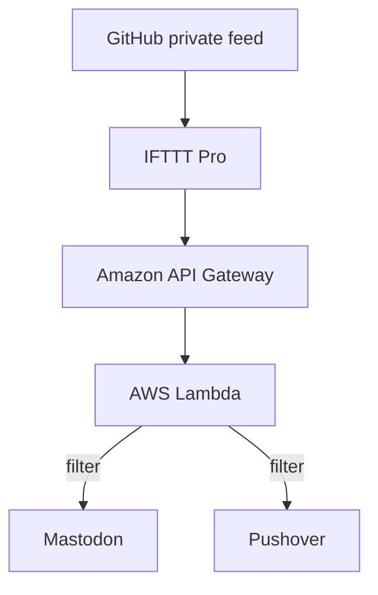
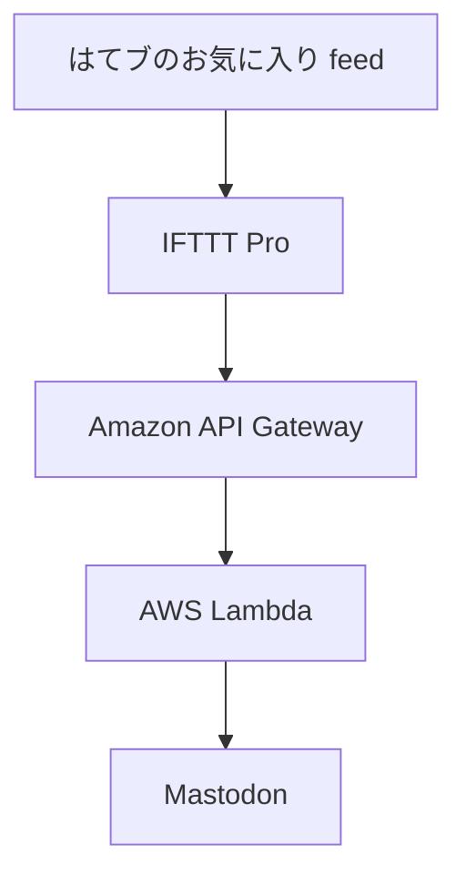

# masutaka-feed

[][deploy]

[deploy]: https://github.com/masutaka/masutaka-feed/actions/workflows/deploy.yml?query=branch%3Amain

## features

### github/

### hatebu/

## deployment

Every push to the `main` branch will deploy SAM Applications.
