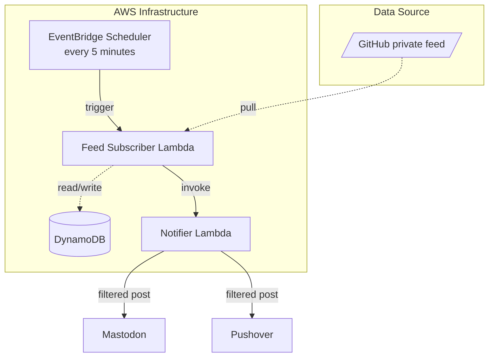
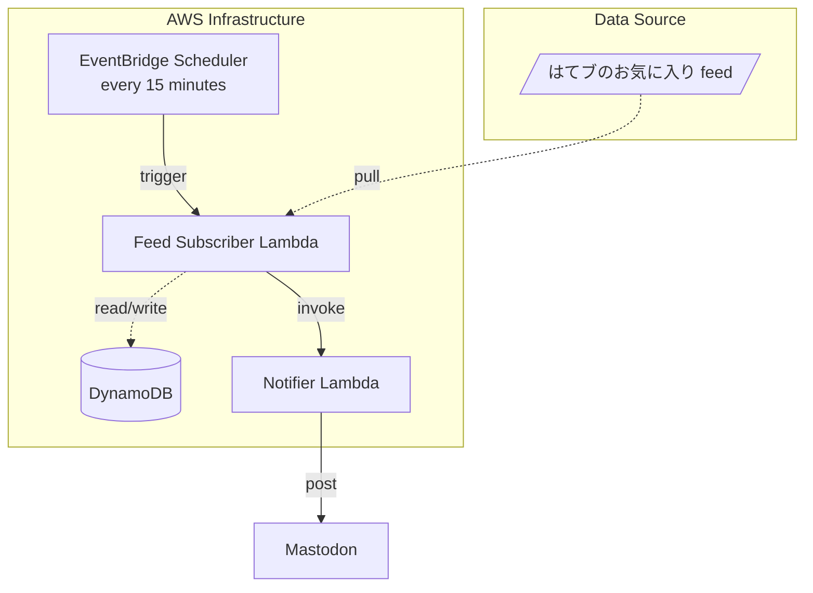

# masutaka-feed

[][Test]
[][deploy]

[Test]: https://github.com/masutaka/masutaka-feed/actions/workflows/test.yml?query=branch%3Amain
[deploy]: https://github.com/masutaka/masutaka-feed/actions/workflows/deploy.yml?query=branch%3Amain

## Features

### github/

### hatebu/

## Deployment

Every push to the `main` branch will deploy SAM Applications.
