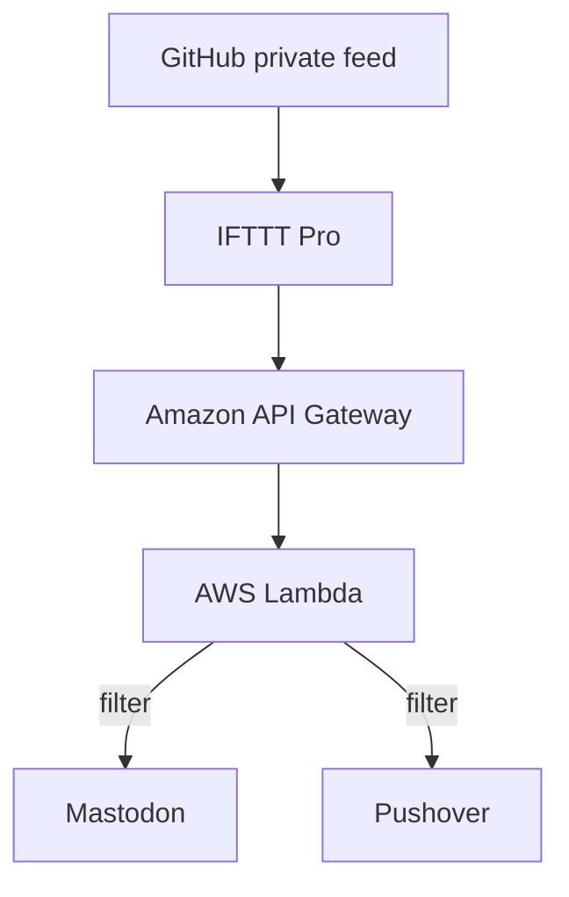
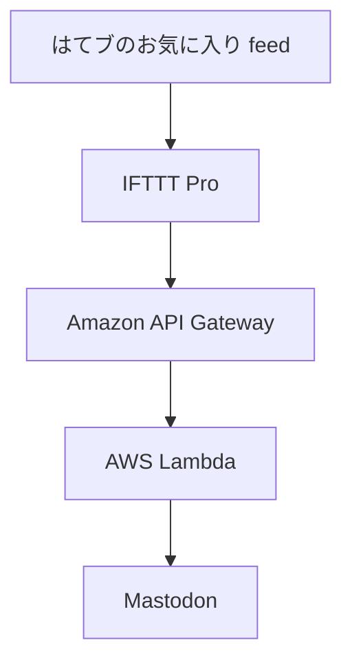

# masutaka-feed

[][codeql]
[][fossa]
[][deploy]

[codeql]: https://github.com/masutaka/masutaka-feed/actions/workflows/github-code-scanning/codeql?query=branch%3Amain
[fossa]: https://app.fossa.com/projects/git%2Bgithub.com%2Fmasutaka%2Fmasutaka-feed?ref=badge_shield
[deploy]: https://github.com/masutaka/masutaka-feed/actions/workflows/deploy.yml?query=branch%3Amain

## features

### github/

### hatebu/

## deployment

Every push to the `main` branch will deploy SAM Applications.

## License

