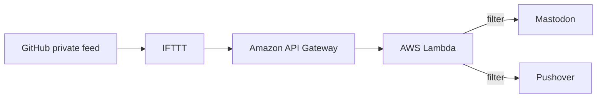
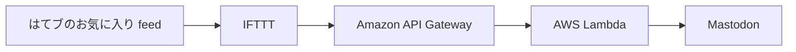

# masutaka-feed

## features

### github/


```mermaid
graph LR
    A[GitHub private feed] --> B[IFTTT]
    B --> C[Amazon API Gateway]
    C --> D[AWS Lambda]
    D -->|filter| E[Mastodon]
    D -->|filter| F[Pushover]
```

### hatebu/


```mermaid
graph LR
    A[はてブのお気に入り feed] --> B[IFTTT]
    B --> C[Amazon API Gateway]
    C --> D[AWS Lambda]
    D --> E[Mastodon]
```

## deployment

```
$ make deploy
```
