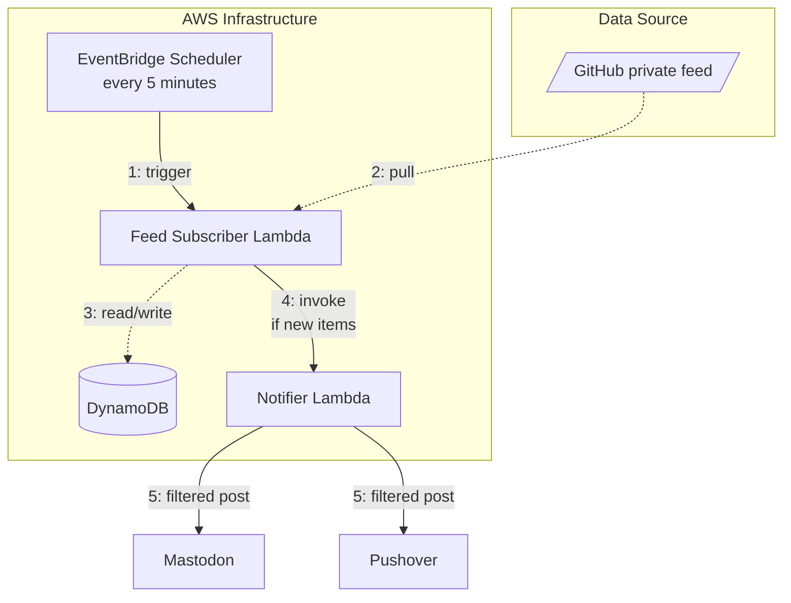
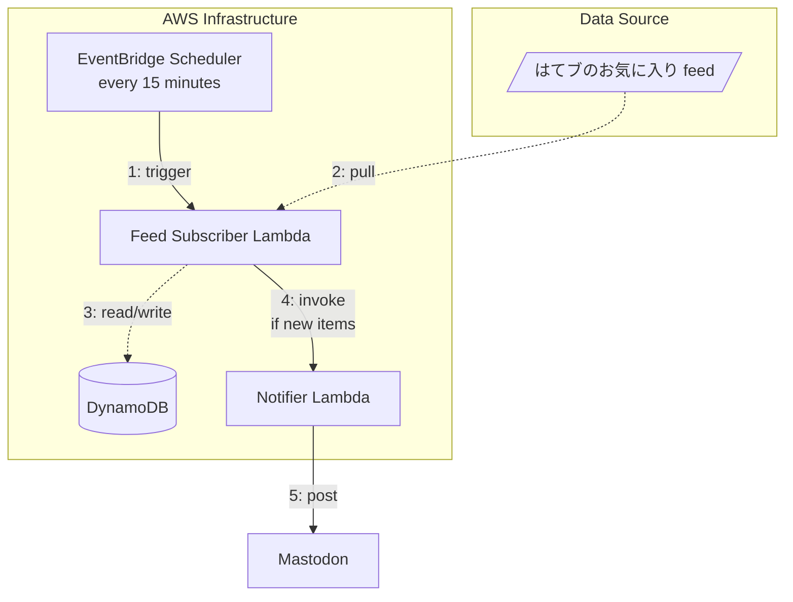

# masutaka-feed

[][Test]
[][Deploy]
[][CodeRabbit]
[][deepwiki]

[Test]: https://github.com/masutaka/masutaka-feed/actions/workflows/test.yml?query=branch%3Amain
[Deploy]: https://github.com/masutaka/masutaka-feed/actions/workflows/deploy.yml?query=branch%3Amain
[CodeRabbit]: https://www.coderabbit.ai/
[DeepWiki]: https://deepwiki.com/masutaka/masutaka-feed

A serverless application that posts personal GitHub activities and Hatena Bookmark favorites to Mastodon and Pushover (partial for Pushover).

## Features

### github/

### hatebu/

## CI/CD (GitHub Actions)

### Test Workflow
- **Trigger**: Push to main branch, Pull Requests
- **Actions**:
  - actionlint: Validate GitHub Actions configuration
  - CodeQL: Security vulnerability scanning
  - lint: TypeScript and ESLint static analysis (`make setup lint`)
  - Pushover notification on failure (main branch only)

### Deploy Workflow
- **Trigger**: After test workflow success (main branch only)
- **Authentication**: AWS OIDC for secure access
- **Deploy**: `make deploy` to deploy SAM application
- **Region**: ap-northeast-1 (Tokyo)

### Other Workflows
- **dependency_review**: Check for dependency vulnerabilities on PRs
- **schedule**: Weekly CodeQL analysis (Friday 19:00 JST)
